# EXAONE 모델 경량화 End-to-End 매뉴얼

> EXAONE-4.0-1.2B 모델 경량화 프로젝트의 전체 워크플로우

## 📋 워크플로우 개요

```mermaid
flowchart LR
    A[1. 환경설정] --> B[2. Baseline 측정]
    B --> C[3. 경량화 실험]
    C --> D[4. 평가 및 비교]
    D --> E[5. 제출파일 생성]
```



---

## 1️⃣ 환경 설정

### 설치

```bash
# uv 패키지 매니저로 의존성 설치
make setup
# 또는
uv sync
```

### MLflow 설정 (선택)

```bash
# .env 파일 생성 (DagsHub 연동)
cp .env.example .env
# 토큰 입력 후 저장
```

---

## 2️⃣ Baseline 측정

Baseline(원본 모델)의 성능/속도를 먼저 측정합니다.

```bash
uv run python src/evaluation/evaluate.py --baseline
```

**결과:**

- `outputs/baseline_result.json` 저장
- MLflow에 `baseline` 태그로 기록

---

## 3️⃣ 경량화 실험

### Hydra 설정 구조

```
configs/
├── config.yaml          # 기본 설정
├── compression.yaml     # 경량화 설정
├── model.yaml           # 모델 설정
└── experiments/         # 실험별 설정
    ├── {mm-dd}_{전략}.yaml  # 날짜_전략명 형식 권장
    └── 예: 02-05_drop-layers-26.yaml
```

> **네이밍 규칙**: `{월-일}_{전략명}.yaml` (예: `02-05_drop-layers-26.yaml`)

### 실험 설정 파일 예시

**configs/experiments/drop_layers.yaml:**

```yaml
# @package _global_
experiment_name: "drop_layers_26"

compression:
  method: "drop_layers"
  keep_layers: 26
  drop_from: "top"

model:
  num_layers: 26
```

### 경량화 실행

#### 방법 1: Hydra 설정 사용

```bash
uv run python src/models/train.py experiments=drop_layers
```

#### 방법 2: CLI 직접 실행

```bash
# Layer Dropping (30 → 26 layers)
uv run python src/models/variants/drop_layers.py \
    --keep-layers 26 \
    --save-path ./submit/model

# Head Pruning
uv run python src/models/variants/prune_heads.py \
    --keep-heads 24 \
    --save-path ./submit/model

# Hidden Dimension 축소
uv run python src/models/variants/reduce_hidden.py \
    --target-dim 1536 \
    --save-path ./submit/model
```

### Makefile 명령어

```bash
make help       # 사용 가능한 명령어 확인
make setup      # 환경 설치
make analyze    # 모델 구조 분석
make train      # 모델 학습/경량화
make eval       # Baseline 평가
make eval-model # 경량화 모델 평가 (submit/model)
make report     # 비교 리포트 생성
make clean      # 출력물 정리
```

---

## 📚 Makefile + configs 활용 예시

### 기본 사용법

```bash
# 1. Baseline 평가
make eval

# 2. 경량화 모델 평가
make eval-model
```

### Hydra 설정 오버라이드

Makefile 대신 직접 실행하면 Hydra 설정을 오버라이드할 수 있습니다:

```bash
# experiments/ 폴더의 설정 파일 사용
uv run python src/models/train.py experiments=drop_layers

# CLI에서 직접 값 변경
uv run python src/models/train.py compression.keep_layers=24 experiment_name=drop_24
```

### 새 실험 설정 추가하기

**Step 1: configs/experiments/에 새 설정 파일 생성**

```yaml
# configs/experiments/drop_layers_24.yaml
# @package _global_

experiment_name: "drop_layers_24"

compression:
  method: "drop_layers"
  keep_layers: 24
  drop_from: "top"

model:
  num_layers: 24
```

**Step 2: 실험 실행**

```bash
# 새 설정 파일로 실행
uv run python src/models/train.py experiments=drop_layers_24
```

### 여러 실험 한번에 실행 (Hydra multirun)

```bash
# 여러 layer 수로 한번에 실험
uv run python src/models/train.py -m compression.keep_layers=22,24,26,28
```

### 완전한 End-to-End 예시

```bash
# 1. 환경 설정
make setup

# 2. Baseline 측정
make eval

# 3. 경량화 실행 (CLI 직접)
uv run python src/models/variants/drop_layers.py \
    --keep-layers 26 \
    --save-path ./submit/model

# 4. 경량화 모델 평가
make eval-model

# 또는 직접 실행 (run-name 지정)
uv run python src/evaluation/evaluate.py \
    --model ./submit/model \
    --run-name "drop_layers_26"

# 5. 제출 파일 생성
./create_submit.sh

# 6. MLflow에서 결과 확인 (DagsHub)
# https://dagshub.com/sthun0211/LGaimers.mlflow
```

## 4️⃣ 평가 및 비교

### 경량화 모델 평가

```bash
# Baseline 대비 비교 평가
uv run python src/evaluation/evaluate.py \
    --model ./submit/model \
    --run-name "drop_layers_26"
```

### 평가 지표

| 지표          | 수식                                         | 설명                     |
| ------------- | -------------------------------------------- | ------------------------ |
| **PerfNorm**  | Perf_model / Perf_base                       | 성능 유지율 (1.0 = 동일) |
| **SpeedNorm** | 1 - (Time/Token)\_model / (Time/Token)\_base | 속도 개선율              |
| **Score**     | max(0.5×PerfNorm + 0.5×SpeedNorm, 0)         | 최종 점수                |

### MLflow 결과 확인

**DagsHub (팀 공유):**

- 🔗 https://dagshub.com/sthun0211/LGaimers.mlflow

**로컬 (선택):**

```bash
uv run mlflow ui
# http://localhost:5000 접속
```

### MLflow에 기록되는 필드

**Parameters (설정값):**
| 필드 | 설명 |
|------|------|
| `number_of_layers` | 레이어 수 |
| `number_of_heads` | Attention Head 수 |
| `hidden_dim` | Hidden Dimension |
| `total_parameters` | 총 파라미터 수 |
| `model_size_mb` | 모델 크기 (MB) |

**Metrics (측정값):**
| 필드 | 설명 |
|------|------|
| `tokens_per_sec` | 초당 생성 토큰 수 |
| `time_per_token_ms` | 토큰당 생성 시간 (ms) |
| `perplexity` | Perplexity (낮을수록 좋음) |
| `perf_norm` | 성능 정규화 (1.0 = Baseline) |
| `speed_norm` | 속도 정규화 (높을수록 빠름) |
| `score` | 최종 점수 (0.5*PerfNorm + 0.5*SpeedNorm) |

> **기록 위치**: `src/evaluation/evaluate.py`의 `mlflow.log_metric()` 호출

---

## 📝 보고서 생성

### 자동 보고서 생성 (권장)

```bash
# 1. 먼저 평가 실행 (eval_result.json 자동 생성됨)
uv run python src/evaluation/evaluate.py \
    --model ./submit/model_drop28 \
    --run-name "drop28"

# 2. 보고서 자동 생성
make report
# 또는
uv run python src/compression/report.py \
    --experiment drop28 \
    --model ./submit/model_drop28
```

### 보고서 디렉토리 구조

```
outputs/
├── baseline_result.json          # Baseline 결과 (기준)
├── {yyyy-mm-dd}_{전략}/
│   └── {yyyy-mm-dd}_report.md    # 자동 생성된 보고서
└── 예: 2026-02-07_drop28/
        └── 2026-02-07_report.md

submit/
├── model_drop28/
│   └── eval_result.json           # 평가 시 자동 저장됨
└── model_fp16/
    └── eval_result.json
```

### 보고서 생성 옵션

```bash
# 기본 사용
uv run python src/compression/report.py -e drop28 -m ./submit/model_drop28

# 설명 추가
uv run python src/compression/report.py \
    -e drop28 \
    -m ./submit/model_drop28 \
    -d "Layer 2개 제거 실험"

# 출력만 (파일 저장 안 함)
uv run python src/compression/report.py -e drop28 -m ./submit/model_drop28 --print-only
```

### 💡 더 상세한 분석이 필요하면?

AI에게 요청하세요:

```
이번 실험 결과 분석해서 보고서 만들어줘
- 실험: Drop28
- Score: 0.44
- 실패 원인 분석 포함해줘
```

## 5️⃣ 제출 파일 생성

### 제출 구조

```
submit/
├── model/                    # 기본 제출 모델
├── model_{strategy}/         # 전략별 모델 (예: model_drop28, model_fp16)
└── 예: model_kd_drop28/
```

**제출 파일 (submit.zip):**

```
submit.zip
└── model/
    ├── config.json
    ├── model.safetensors
    ├── tokenizer.json
    └── ...
```

> **모델 저장 규칙**: `submit/model_{전략명}/` (예: `model_drop28`, `model_fp16`)

### 생성 명령

```bash
# submit.zip 생성
./create_submit.sh
```

### 체크리스트

- [ ] `submit/model/` 에 경량화 모델 저장됨
- [ ] `config.json`의 `transformers_version`이 서버와 일치 (4.57.3)
- [ ] `model.safetensors` 파일 존재
- [ ] 토크나이저 파일들 포함

---

## 📊 실험 결과 정리

| 실험                  | Params | Perplexity | PerfNorm | SpeedNorm | Score     | 비고    |
| --------------------- | ------ | ---------- | -------- | --------- | --------- | ------- |
| **Baseline**          | 1.28B  | 2,660      | 1.000    | 0.000     | **0.500** | 기준    |
| Drop 2 layers (28)    | 1.21B  | 3,797      | 0.700    | 0.182     | 0.441     | ❌      |
| Drop 4 layers (26)    | 1.13B  | 5,500+     | 0.48     | 0.25      | 0.365     | ❌      |
| Head Pruning (24)     | 1.15B  | -          | 0.62     | 0.18      | 0.310     | ❌      |
| **FP16 Quantization** | 1.28B  | 2,660      | 1.000    | ~0.05     | **~0.52** | ✅ 권장 |

> **결론**: 구조적 압축(Layer/Head 제거)은 성능 손실이 커서 Baseline 미달.
> **FP16 Quantization**이 유일하게 Baseline 성능 유지하면서 속도 개선.

---

## 🔧 트러블슈팅

### vLLM 오류 발생 시

- `config.json`의 `transformers_version`을 `4.57.3`으로 수정
- `dtype` 필드 제거

### MPS 오류 (macOS)

- `device_map` 대신 `.to(device)` 사용
- 이미 `exaone_base.py`에 자동 처리됨

---

## 📁 주요 파일 위치

| 파일                                 | 용도           |
| ------------------------------------ | -------------- |
| `src/models/base/exaone_base.py`     | 원본 모델 로드 |
| `src/models/variants/drop_layers.py` | Layer Dropping |
| `src/compression/analyze.py`         | 모델 구조 분석 |
| `src/evaluation/evaluate.py`         | 성능/속도 평가 |
| `outputs/baseline_result.json`       | Baseline 결과  |
| `submit/model/`                      | 제출용 모델    |
